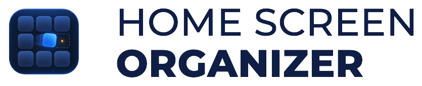
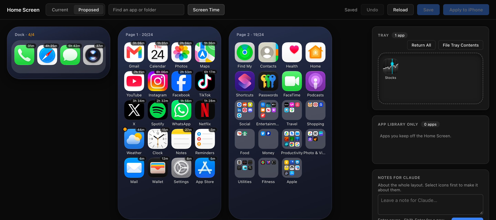

<p align="center">
  <picture>
    <source media="(prefers-color-scheme: dark)" srcset="docs/brand/logo-dark.png">
    
  </picture>
</p>

View and reorganise an iPhone Home Screen from a Mac over USB.

It reads your iPhone layout into local files, displays it in a browser editor, and lets you prepare a new layout before applying it. Applying is always a separate, deliberate action. Optionally, Screen Time data can rank apps so frequently used apps are placed first.



## What you can do

- Read the current Home Screen, including icon images.
- Draft and edit a proposed layout with pages, folders, a dock, a Tray, and an App Library Only list.
- Generate a proposal from a folder scheme, optionally ranked by Screen Time usage.
- Ask Claude Code to help organize the draft and resolve notes.
- Apply or restore a layout over USB, with backups and verification.

## Requirements

| Needed for | Requirement |
| --- | --- |
| Core workflow | A Mac, Python 3.11+, and an iPhone connected by USB, unlocked, and already trusting the Mac. |
| Guided workflow (optional) | [Claude Code](https://claude.com/product/claude-code). |
| Screen Time ranking (optional) | Screen Time shared across devices and `swiftc` from Xcode Command Line Tools. |

There is no npm install, framework, or build step. The editor is a single HTML file.

## Quick start

```bash
git clone https://github.com/justinleveck/homescreen-organizer.git
cd homescreen-organizer
bin/homescreen-setup
```

### Guided workflow

Open the repository in Claude Code and say: **“organize my home screen.”** Claude can read the phone, help create folders based on your installed apps, update the draft, and guide you through applying it.

### Command-line workflow

```bash
bin/homescreen-read      # iPhone -> state/current.json, state/icons/, state/backups/
bin/homescreen-propose   # state/scheme.json (+ state/usage.json) -> state/proposed.json
bin/homescreen-serve     # editor at http://localhost:8765/web/ (pass a port to change it)
bin/homescreen-notes     # print open editor notes for Claude
bin/homescreen-apply     # state/proposed.json -> iPhone, after backup and prompt
bin/homescreen-apply --restore state/backups/<file>.json
```

`bin/homescreen-propose` needs `state/scheme.json`, which says where apps belong. On first run it copies `templates/scheme.starter.json` to that path. Treat that as a starting point: replace it with a plan based on your own apps, manually or with Claude, then re-run `propose` whenever the plan changes.

The editor can also run the apply flow; see [Apply to iPhone](#apply-to-iphone).

## Normal workflow

1. Connect and unlock the iPhone, then run `bin/homescreen-read`.
2. Create or refine `state/scheme.json`, then run `bin/homescreen-propose`.
3. Run `bin/homescreen-serve` and edit **Proposed** in the browser.
4. Save. Resolve every blocking issue shown by **Check**, and empty the Tray.
5. Use **Apply to iPhone** or `bin/homescreen-apply`. Confirm only when the iPhone is connected and unlocked.
6. If necessary, use **Restore Previous** in the editor or `bin/homescreen-apply --restore <backup>`.

## Editor

Run `bin/homescreen-serve`, then open the printed address. The server is required: browsers cannot load the JSON from `file://`, and Save writes through this server.

### Views and editing

- **Current** is the last layout read from the iPhone. It is read-only.
- **Proposed** is the editable draft.
  - Drop at an icon’s edge to place beside it.
  - Drop on an icon’s middle to create or add to a folder.
  - Drop on empty space to add at the end of a page.
  - Double-click a folder to open and rename it.
  - Drag an app out of an open folder to remove it.
  - Add or remove empty pages as needed.
- **Selection:** click to select; ⌘/Ctrl-click to add or remove items; Shift-click to select a run within one page or folder; Escape to clear. Dragging a selected icon moves the whole selection.
- **Search** matches app and folder names. Selecting a folder scrolls to and opens it. Selecting an app inside a folder opens that folder and highlights the app.

### Tray and App Library Only

Use these deliberately; both are saved with the layout.

| Feature | Use it for | Important behavior |
| --- | --- | --- |
| **Tray** | Temporarily set apps aside while deciding where they go. | Drag apps or a selection in, or right-click **Set Aside**. Drag them back to a page, folder, or icon; **Return All** restores each app to its origin. The Tray saves to `state/tray.json`. Tray apps count as placed, but Apply is blocked until it is empty. |
| **App Library Only** | Apps intentionally kept off the Home Screen. | Right-click **Keep in App Library Only** or drag to its card. Drag out or use **Put Back on Home Screen** to return an app (returning it to the Tray is valid). Saved in `state/app-library-only.json` as `{displayIdentifier, displayName}`. These apps count as placed, are not Tray strays, and do not cause Check failures. |

`setIconState` cannot hide an app. iOS may still report or restore an App Library Only app on the Home Screen; that is expected, not an Apply failure. `lib/propose.py` never places listed apps, and `lib/file_tray.py` routes them directly to App Library Only.

### File Tray Contents

**File Tray Contents** files every Tray app without involving an agent. It uses `lib/file_tray.py` and `state/scheme.json`:

- Matches app names with `usage.normalised`.
- Finds the existing layout folder containing the most other apps from that scheme folder; this vote respects folder renames and manual rearranging.
- Falls back to a layout folder with the same name.
- Inserts by usage score before the first lower-scoring app, then re-pages folders in groups of nine.
- Sends an **App Library Only** app there regardless of the scheme; this list wins.
- Leaves unlisted or deliberately loose apps loose, just before the first folders with room. It uses page 1 only when no page of folders has room.

New phone apps absent from a loaded proposal are automatically put through the same filing logic on load, then land in the Tray only as a last resort. This automatic filing is one Undo step. Filing changes **Proposed**, marks it unsaved, and reports where each app went.

When the tool itself places a loose app—during new-arrival filing, **Put Back on Home Screen**, or **Return All** after the remembered page is gone—it inserts after that page’s loose apps and before its first folder. If full, it uses the next page with room. See `placeLoose` in the editor and `place_loose` in `lib/layout.py`.

### Screen Time display

The top-bar **Screen Time** toggle shows or hides usage and is remembered by the browser.

- An app used this week shows a badge with weekly time (for example, `2h 41m`) or a pickup rank (for example, `#19 pickup`) when it has almost no time.
- Hover for full numbers and the score.
- **Most used this week** lists the top 15 in the side panel.

### Check, Save, and Undo

- **Check** blocks Apply when an iPhone app is not placed exactly once, the dock has more than four apps or contains a folder, a page exceeds 24 apps, or the Tray is nonempty. Folders automatically re-page in nines.
- Check also warns—but does not block Apply—when loose apps appear after a folder on a page. A drag may still place an app anywhere.
- **Save** writes `state/proposed.json`, `state/tray.json`, and `state/app-library-only.json`. It saves drafts even when Check has problems. The server accepts PUT or POST only for those files and `/state/notes.json`; it refuses all other write paths.
- **Undo** (top bar, ⌘Z, or Ctrl-Z) reverses the last edit, including moves, drags, folder changes, Tray and App Library Only actions, File Tray Contents, and automatic new-app filing. Browser undo takes precedence in text fields. Up to 50 deep-copy steps cover the layout, Tray, App Library Only list, and origins; Reload clears history. Notes are not included.

## Apply to iPhone

When the draft is saved, Check has no blocking problems, and the Tray is empty, **Apply to iPhone** becomes available.

1. Click it to review a summary of moved apps, folder additions/removals/renames, and page count before → after. The browser calculates this from `state.current` and `state.proposed`.
2. Read the warning: widgets and Smart Stacks may not survive. Connect the iPhone by cable and unlock it.
3. Confirm. The editor calls `POST /apply`, which runs `bin/homescreen-apply --yes` with an approximately 90-second timeout. A second apply or restore cannot run while one is in progress.
4. Review the monospace result panel. On success, the editor reloads state because `homescreen-apply` rewrites `state/current.json`.

**Restore Previous** appears when `state/backups/` contains a backup whose name includes `before-apply`. The editor reports the newest one through `GET /backups.json`, names its time in a confirmation, and calls `POST /restore`, which runs `bin/homescreen-apply --restore <backup> --yes` through the same runner.

To test editor apply and restore flows without touching a phone, set `HOMESCREEN_APPLY_COMMAND` to a stand-in command. It overrides the command used by `serve.py` for both endpoints; by default it is the real `bin/homescreen-apply`.

## Notes for Claude

Use the **Notes for Claude** box in the side panel to leave a note about the selection, or about the whole layout when nothing is selected. Whole-layout notes have an empty `apps` list.

- Right-click an icon or selection in either mode and choose **Leave a note…**. Enter saves; Shift-Enter adds a line.
- One-click notes: **Move to page 1**, **Put in a folder with these** (two or more apps), and **Delete this app**.
- “Delete this app” is a note for a human, not an action. To keep an app off the Home Screen, use **App Library Only**.
- Open notes show a yellow dot on the icon; hover to read them. The side panel lists open notes with Delete, while completed notes are collapsed with Claude’s reply.

Notes save immediately to `state/notes.json` as `{id, createdAt, apps: [{displayIdentifier, displayName}], text, status, reply}`.

Claude reads open notes with `bin/homescreen-notes` and changes only `state/proposed.json`, never the phone. For each completed note, it sets `status` to `"done"` and adds a one-line `reply` describing the change. `state/proposal.md` summarizes the current draft—what went where and why.

## Screen Time (optional)

Screen Time ranking is optional. The editor, Check, and Apply work without it.

When usage is available, `bin/homescreen-propose` scores each app by weekly minutes first, then pickup rank, then notification rank. It places the top 24 non-dock apps loose on page 1, most-used first. The editor then exposes the usage badges and list described above.

### Setup

The local helper needs **Full Disk Access** to read the Screen Time database. Grant it to the helper binary itself—not Terminal or Claude.

```bash
bin/homescreen-usage-install   # build, install, and open the Full Disk Access pane
bin/homescreen-usage           # copy this week's Screen Time to state/usage.json
```

You also need the Mac and iPhone signed in to the same Apple ID, with **Settings > Screen Time > Share Across Devices** enabled on the iPhone. Initial sync can take a few hours.

Claude Code can guide setup, including the Full Disk Access pane and sync troubleshooting; see the **Screen Time** section of `.claude/skills/homescreen/SKILL.md`.

If useful, enter these optional rankings manually in `state/usage.json`:

- `week.first_used_after_pickup`
- `week.notifications`

Copy them in rank order from the iPhone: **Settings > Screen Time > See All App & Website Activity > Week**.

## Safety model and limits

### What is safe to do

- **Reading is harmless.** `homescreen-read` only calls SpringBoard getters (`get_icon_state`, `get_icon_pngdata`) in one USB session. Each read creates a timestamped layout backup in `state/backups/`.
- **Nothing writes to the iPhone except `homescreen-apply`.** That includes direct runs and the editor’s Apply and Restore actions, which only shell out to it.
- **It never deletes an app.** “Delete this app” is only a note. App Library Only is the sole mechanism for requesting an app be left off the Home Screen, and even that cannot be guaranteed by `setIconState`.

### What Apply checks and does

`homescreen-apply` (including `--restore <backup>`) follows this sequence:

1. Refuses if the editor Tray contains apps.
2. Reads the live layout and refuses unless the layout to apply contains every currently installed app exactly once. Apps installed or removed since the proposal are caught here. App Library Only apps are exempt because the proposal intentionally omits them.
3. Prompts for `yes`; use `--yes` only when you intend to skip that prompt.
4. Backs up the live layout as `state/backups/<time>-before-apply.json`.
5. Sends the layout with `SpringBoardServicesService.set_icon_state(newstate)`, built from the live icon records rather than saved JSON because JSON loses SpringBoard’s plist dates.
6. Reads back the result, updates `state/current.json`, and evaluates it with App Library Only apps set aside. It reports whether the layout matches, is unchanged, or was only partly applied; it prints a restore command and, if iOS restored App Library Only apps, a checklist for removing them manually.

### iOS limitations

Current iOS versions may ignore `setIconState` without an error. SpringBoard has also historically not replied to this call, so the send uses a 10-second deadline. The read-back is authoritative:

- If it says **“iOS ignored the layout,”** nothing changed on the phone.
- The editor remains useful as a manual checklist: open **Proposed** beside the phone and arrange it page by page and folder by folder. Search shows where each app belongs.
- Widgets and Smart Stacks may not be preserved because the read layout does not include them. App Library settings and hidden pages may also change.

## Privacy

`state/` contains your phone layout, icons, usage, notes, and backups. It is gitignored, and `bin/homescreen-setup` creates it locally.

To version your own layout and folder scheme without adding them to this repository, replace `state/` with a link to a private repository:

```bash
rm -rf state   # only after confirming it contains nothing you still need
ln -s /path/to/your-private-homescreen-state state
```

The scripts, editor, and starter scheme remain public and shareable.

## Repository layout

| Path | Contents |
| --- | --- |
| `bin/` | Command entry points; Bash wrappers around `lib/`. |
| `lib/` | `layout.py` (rules, validation, diff), `phone.py` (USB session), `usage.py` (scores), `read.py`, `propose.py`, `apply.py`, `serve.py`, `notes.py`, and `file_tray.py` (File Tray Contents). |
| `web/` | `index.html`, the one-file editor with no build step. |
| `helper/` | `screentime-copy.swift`, the Full-Disk-Access helper. |
| `templates/` | `scheme.starter.json`, a generic folder-plan starting point. |
| `.claude/` | `skills/homescreen/SKILL.md`, enabling Claude Code to guide the workflow. |
| `state/` | Local-only, gitignored data: `current.json`, `proposed.json`, `proposed.generated.json`, `tray.json`, `notes.json`, `proposal.md`, `usage.json`, `scheme.json`, `usage-scores.json`, `app-library-only.json`, plus `icons/`, `backups/`, and `screentime/`. |
